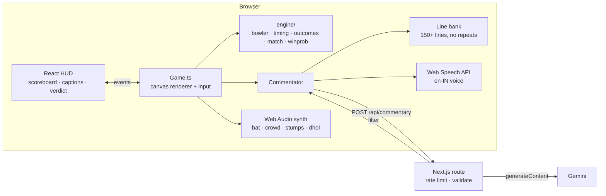

# Last Over Legends 🏏

An arcade cricket chase for the browser. You get one over (or three), a target, and **Bhaskar**, a
gloriously over-the-top commentator who talks you through every ball. His lines are generated live
by Google Gemini, with a hand-written bank of 150+ lines as an instant fallback.

- **Super Over**: 6 balls, 2 wickets, chase 14–24.
- **Death Overs**: 18 balls. Gully: 30 to win with 5 wickets. Club: 38 with 4. International: 45 with 3.
- **Daily Challenge**: the same scenario and ball sequence for everyone, seeded by the IST date.
- **Locker**: achievements, career stats and unlockable jerseys, saved in the browser.

Every team and player is fictional, and all art and sound are generated in code, so there are no asset files.

## Phones, tablets and desktop

The same build adapts to whatever it runs on:

- **Phones (portrait and landscape):** tap or swipe to bat. The camera reframes for tall screens, and the HUD compacts on short landscape screens. A hint suggests rotating, but portrait is fully playable. Safe areas around notches and home bars are respected. On Android there's a fullscreen button. iPhones hide it because Safari doesn't support fullscreen for web pages.
- **Tablets:** touch controls with the larger layout.
- **Desktop and laptop:** keyboard (or mouse) controls. On-screen hints show the key for each zone, Bhaskar's caption sits in the top bar, and `F` toggles fullscreen.

Control hints follow the input in use: touch hints after a tap, key hints after a key press.

## Controls

| | Ground shot | Lofted shot |
|---|---|---|
| Touch | Tap left / middle / right (leg / straight / off) | Swipe up from that zone |
| Keyboard | `A` `S` `D` or `←` `↓` `→` | `Q` `W` `E`, `↑`, or Shift + arrow |

`Space` faces the next ball (or skips the commentary), `Esc` pauses, `M` mutes, `F` toggles fullscreen.
Time the swing so the bat meets the ball as the ring closes. International has no ring.

## Run locally

```bash
npm install
cp .env.example .env.local   # then paste your Gemini key into GOOGLE_API_KEY
npm run dev                  # http://localhost:3000
```

```bash
npm test          # outcome engine, timing, match rules, daily seed, line bank, filter, rate limiter
npm run typecheck
npm run build
```

With no key set, the game still works: Bhaskar uses the line bank only.

## Deploy to Vercel

1. On vercel.com, choose **Add New → Project** and import this GitHub repo. The framework is detected as **Next.js**. Leave every build setting at its default.
2. Under **Environment Variables**, add `GOOGLE_API_KEY` with your Gemini key. `GEMINI_API_KEY` also works.
3. Click **Deploy**.

Optional: set `GEMINI_MODEL` to override the default model, `gemini-flash-lite-latest`.

## Environment variables

| Name | Required | Purpose |
|---|---|---|
| `GOOGLE_API_KEY` or `GEMINI_API_KEY` | no | Enables live AI commentary |
| `GEMINI_MODEL` | no | Model id. The default is `gemini-flash-lite-latest`, which replies in about 0.5–0.8s |

The key is only read on the server (`app/api/commentary/route.ts`), so it never reaches the browser.

## How it fits together



## AI commentary design

- **When it's used**: sixes, wickets, the final over, the last ball, the result and the end-of-match verdict. There are at most **6 AI calls per match**, and 2 of them are always kept back for the result and the verdict.
- **Timeout**: if the AI line isn't back within **2.5s**, Bhaskar speaks a bank line instead and the late reply is thrown away. The server aborts its own Gemini call at 2.3s.
- **Character lock**: the system prompt fixes Bhaskar's persona and tells him to use only the fictional names he's given. Each reply goes through `commentary/filter.ts`, which **rejects** anything over 30 words, anything out of character ("as an AI…"), markdown, any of ~70 banned real cricketer, commentator and league names, and any "Firstname Lastname" pair that isn't one of this match's fictional players. A rejected reply falls back to the line bank.
- **Abuse protection**: input is validated and clamped, and there's a per-IP limit of 30 requests/minute. The limiter is in memory, so it's per serverless instance. That's fine for a demo. A global limit would need something like Upstash Redis.

## Outcome model

Timing windows, measured in ms from the ideal contact point:

| Difficulty | Perfect | Good | Early/Late |
|---|---|---|---|
| Gully | ±45 | ±100 | ±200 |
| Club | ±30 | ±70 | ±160 |
| International | ±20 | ±50 | ±130 |

Each timing grade maps to an outcome table for ground and lofted shots. The tables are in `game/engine/outcomes.ts`, and every row sums to 100. These modifiers apply on top:

- **Yorker**: timing windows are 35% smaller, a lofted yorker can be at best Good, and the bowled share on a miss is ×1.5.
- **Bouncer**: lofted leg-side shots get +15 on six, and off-side ground shots get +10 on edge. A bouncer can't bowl you.
- **Full toss**: timing windows are 50% bigger and six chance goes up.
- **Slower ball**: arrives about 180ms later than the bowler's pace suggests.
- **Swing**: off-side shots get +10 on edge, and playing across the line gets +10 on bowled/LBW.
- **Matching the ball's line**: +8 to boundaries. Playing against the line moves 8 points to edge or LBW.
- **Fielding**: 6% of catches are dropped, and 4% of boundaries are turned into a catch or a single by a stunning save.
- **Hot streak**: after 3 Good-or-better contacts in a row, the next Perfect shot plays in slow-mo with +10 on six.
- **Extras**: wides and no-balls come only from the bowler, 4% of balls on Gully down to 2% on International. Each adds a run and the ball is bowled again. You can't be out off a no-ball.

Win probability runs 300 simulated finishes from the current state, using an average player's timing, and updates every ball.

## Project layout

```
app/                    pages (title, play/[mode], locker) + api/commentary
components/             GameShell, Scoreboard, WinProbBar, LowerThird, VerdictCard, …
game/Game.ts            game loop, input, ball physics, effects
game/render/            perspective camera, procedural players and stumps
game/engine/            pure rules: rng, bowler, timing, outcomes, match, winprob
commentary/             line bank, filter, prompt, AI client, speech, commentator
audio/sfx.ts            Web Audio synthesis
data/                   fictional teams, achievements, jerseys
lib/                    config, storage, progress, share card, rate limiter
tests/                  vitest unit tests
```

## Changes from the original plan

- **Gemini instead of Anthropic** for live commentary, at the owner's request.
- **Plain Canvas 2D instead of Phaser.** One fewer dependency, a smaller bundle, and full control over the behind-the-batter camera.
- **Slow-mo instead of a separate replay scene.** Big moments such as hot-streak sixes and last-ball sixes play in slow motion.
- AI lines are fetched whole and then revealed with a typewriter effect in the caption, instead of being streamed. Speech needs the full sentence anyway.
